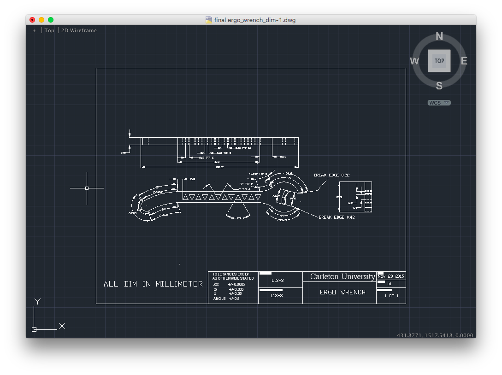

# Ergo-wrench-design

Created for carleton fall term engineering course. The goal of this project was to take an existing object and improve upon it.
What my group members and i did was improve the ergonomics of the wrench by adding a longer curved handle so that the wrench
handle wouldn't dig into the palm of the hand, the longer length also serves to increase the torque and reduce the strenth
needed to tighten a bolt. The triangular holes in the handle are there to reduce the weight of the wrench so that it's not 
as heavy to hold and use, the reason triangles where used instead of another shape is because of the natural strength of the
shape

View 3D model [here](ergo_wrench_3d.stl)

